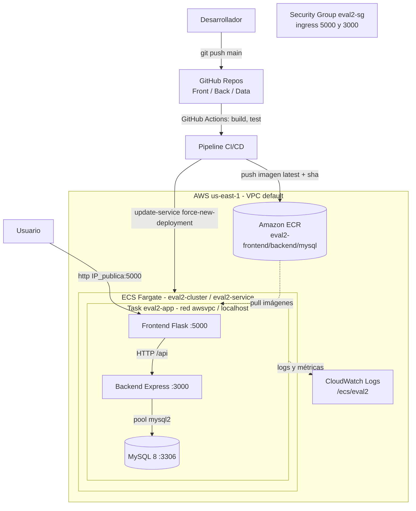

# Arquitectura y Despliegue — EFT DevOps (ISY1101)

Plataforma de gestión de usuarios compuesta por **frontend**, **backend** y **base de datos
relacional**, con CI/CD automatizado en **GitHub Actions** y despliegue en **AWS ECS Fargate**.

## 1. Componentes

| Componente | Tecnología | Puerto | Repositorio | Imagen ECR |
|------------|------------|--------|-------------|------------|
| Frontend   | Flask + Gunicorn (Python 3.12) | 5000 | Front_Eval2 | `eval2-frontend` |
| Backend    | Express (Node 20)             | 3000 | Back_EVAL2  | `eval2-backend`  |
| Base datos | MySQL 8                        | 3306 | Data_Eval2  | `eval2-mysql`    |

Comunicación: el **frontend** consume el API del **backend** (`BACKEND_URL`), y el backend
se conecta a **MySQL** mediante un *pool* de conexiones (`mysql2`). La base de datos se
inicializa automáticamente con los scripts SQL (creación de tablas, datos semilla,
procedimientos y triggers de auditoría).

## 2. Contenerización (buenas prácticas aplicadas)

- **Dockerfile multietapa** en frontend y backend (etapa de dependencias + imagen final).
- **Imágenes base minimalistas**: `python:3.12-slim`, `node:20-alpine`, `mysql:8.0`.
- **Mínimo privilegio**: los contenedores corren como **usuario no-root** (UID 1001 / `node`).
- **`.dockerignore`** para excluir `.git`, `.env`, dependencias y artefactos del build.
- **Puertos mínimos** expuestos (solo el de cada servicio).
- **Healthchecks** definidos por contenedor.
- Escaneo de vulnerabilidades habilitado en ECR (`scanOnPush=true`).

### Entorno local (Docker Compose)

Clonar los tres repositorios como carpetas hermanas y levantar:

```bash
docker compose -f Back_EVAL2/docker-compose.yml up --build
# Frontend: http://localhost:5000   Backend: http://localhost:3000
```

## 3. Registro de imágenes (Amazon ECR)

Cada imagen se publica con dos etiquetas para trazabilidad:
- `latest` → versión activa en despliegue.
- `<git-sha>` → trazabilidad exacta del commit que la generó.

```
568009911039.dkr.ecr.us-east-1.amazonaws.com/eval2-frontend:latest
568009911039.dkr.ecr.us-east-1.amazonaws.com/eval2-backend:latest
568009911039.dkr.ecr.us-east-1.amazonaws.com/eval2-mysql:latest
```

## 4. Pipeline CI/CD (GitHub Actions)

Cada repositorio tiene su workflow `.github/workflows/ci-cd.yml` que se dispara con
`push` a `main` (o manualmente). Etapas:

1. **Build** — checkout del código.
2. **Test** — backend: smoke test (`npm test`); frontend: validación de importación;
   data: arranque del contenedor y verificación de la inicialización de la BD.
3. **Push** — build de la imagen y publicación en Amazon ECR (`latest` + `sha`).
4. **Deploy** — `aws ecs update-service --force-new-deployment` y espera de estabilización.

Los secretos de AWS se inyectan desde **GitHub Secrets** (`AWS_ACCESS_KEY_ID`,
`AWS_SECRET_ACCESS_KEY`, `AWS_SESSION_TOKEN`), nunca en el código.

## 5. Infraestructura en AWS

- **Región**: `us-east-1`
- **VPC**: default (`vpc-0c2537b8d9174a26a`), subredes públicas.
- **Orquestación**: **Amazon ECS Fargate** — clúster `eval2-cluster`, servicio `eval2-service`.
- **Task definition** `eval2-app`: 3 contenedores (mysql + backend + frontend) que comparten
  red `awsvpc` y se comunican por `localhost`. Orden de arranque controlado con `dependsOn`
  (mysql *healthy* → backend *healthy* → frontend).
- **Security Group** `eval2-sg`: ingress sólo a los puertos 5000 (frontend) y 3000 (API);
  MySQL (3306) no se expone a Internet.
- **IAM**: rol `LabRole` como *execution* y *task role* (mínimo privilegio del entorno).
- **Observabilidad**: logs centralizados en **CloudWatch** (`/ecs/eval2`, prefijos
  `frontend` / `backend` / `mysql`) y métricas de CPU/memoria del servicio ECS.

> **Nota de diseño (AWS Academy Learner Lab):** el laboratorio restringe `AWS Cloud Map`
> (Service Discovery) y la creación de roles IAM, por lo que los tres contenedores se
> consolidan en una sola *task* con comunicación por `localhost`, en lugar de tres servicios
> independientes con DNS interno. Es el patrón soportado y estable en este entorno.

## 6. Diagrama de arquitectura



## 7. Verificación

```bash
# Endpoints en la nube (la IP pública cambia en cada despliegue de la task)
curl http://<IP_PUBLICA>:5000/            # Frontend (lista de usuarios)
curl http://<IP_PUBLICA>:3000/api/usuarios # Backend (lee MySQL)
curl http://<IP_PUBLICA>:3000/health       # Healthcheck del backend
```
